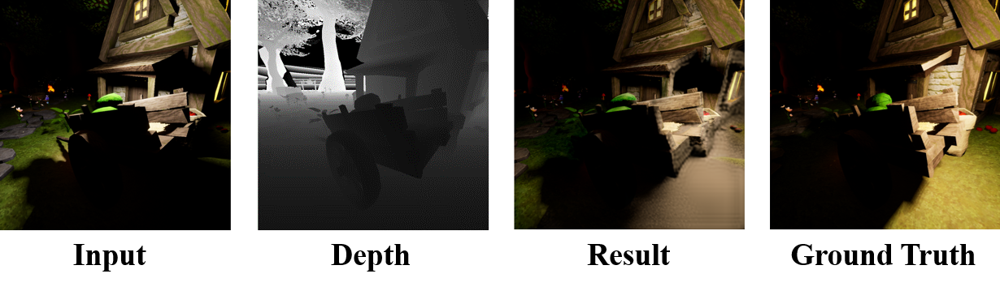

# Multi-modal Bifurcated Network for Depth Guided Image Relighting (MB-Net)

NTIRE 2021 Depth Guided Relighting Challenge Track 1: One-to-one relighting (CVPR Workshop 2021)  *1 st* Solution.

# Abstract:
Image relighting aims to recalibrate the illumination setting in an image. In this paper, we propose a deep learning-based method called multi-modal bifurcated network (MBNet) for depth guided image relighting. That is, given an image and the corresponding depth maps, a new image with the given illuminant angle and color temperature is generated by our network. This model extracts the image and the depth features by the bifurcated network in the encoder. To use the two features effectively, we adopt the dynamic dilated pyramid modules in the decoder. Moreover, to increase the variety of training data, we propose a novel data process pipeline to increase the number of the training data. Experiments conducted on the VIDIT dataset show that the proposed solution obtains the *1 st* place in terms of SSIM and PMS in the NTIRE 2021 Depth Guide One-to-one Relighting Challenge.

<p align="center"></p>

The paper has been accepted by CVPRW 2021.

[[Paper Download]](https://openaccess.thecvf.com/content/CVPR2021W/NTIRE/papers/Yang_Multi-Modal_Bifurcated_Network_for_Depth_Guided_Image_Relighting_CVPRW_2021_paper.pdf)

### Testing
#### 1. Cloning the repository
```bash
$ git clone https://github.com/weitingchen83/NTIRE2021-Depth-Guided-Image-Relighting-MBNet
$ cd NTIRE2021-Depth-Guided-Image-Relighting-MBNet
```
#### 2. Download the pre-trained [model](https://drive.google.com/file/d/1x5UKgZ6DgcIGnmp1wATAfxDDZN5fwEQo/view?usp=sharing) and testing images

Put model weights into model/ <br />
Put images into test/ <br />
Images contain guide and input folders <br />

#### 3. Testing
```bash
    cd code
    python demo.py --input_data_path <'input' folder> --output_dir <output folder> --name <folder name in output folder> --model_path <pre_trained model path>

    Ex:
    python demo.py --input_data_path ../test --output_dir ../submit_result --name test --model_path ../model/weight.pkl
```

### Relit Images

[Here](https://github.com/majedelhelou/VIDIT) is the original images from VIDIT dataset

We also provide the relit images by our MB-Net: [val](https://drive.google.com/file/d/1ceMjPHX-H97Ub7bhpbkSEnXw3xAI0k2U/view?usp=sharing) and [test](https://reurl.cc/NX2Nak).

### Another solution (*3rd* Solution, NTIRE 2021 Depth Guided Relighting Challenge Track 2: Any-to-any relighting) of our team: 

https://github.com/dectrfov/NTIRE-2021-Depth-Guided-Image-Any-to-Any-relighting


# Citations
Please cite this paper in your publications if it is helpful for your tasks:    

Bibtex:
```
@inproceedings{yang2021multi,
    title     = {Multi-modal Bifurcated Network for Depth Guided Image Relighting},
    author    = {Yang, Hao-Hsiang and Chen, Wei-Ting and Luo, Hao-Lun and Kuo, Sy-Yen},
    booktitle = {Proceedings of the IEEE Conference on Computer Vision and Pattern Recognition Workshops (CVPRW)},
    year      = {2021}
}
```
